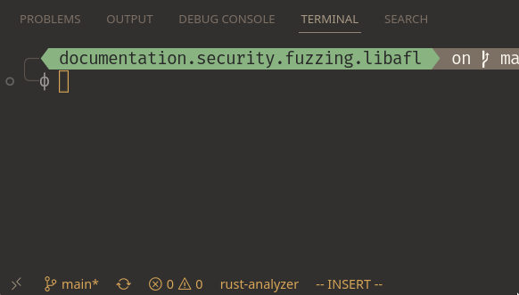

# Table of Contents

- [Table of Contents](#table-of-contents)
- [Install Docker Engine](#install-docker-engine)
- [Post-Install Docker Engine Steps](#post-install-docker-engine-steps)
- [Install VirtualBox](#install-virtualbox)
  - [Install On Ubuntu, Debian, SUSE](#install-on-ubuntu-debian-suse)
  - [Install On Fedora, RHEL](#install-on-fedora-rhel)
  - [Test VirtualBox](#test-virtualbox)
- [Install VSCode](#install-vscode)
- [Open Repository In Dev Container](#open-repository-in-dev-container)
- [Test Tools](#test-tools)


# Install Docker Engine

To set up a Linux host to follow this training, you need to first install Docker Engine.

You can find installation instructions
at [docker.com](https://docs.docker.com/engine/install/) for your distribution. Note
you should install *Docker Engine*, not *Docker Desktop*. For some distributions, you can
follow these quick links:

- [Debian](https://docs.docker.com/engine/install/debian/)
- [Fedora](https://docs.docker.com/engine/install/fedora/)
- [CentOS](https://docs.docker.com/engine/install/centos/)
- [Ubuntu](https://docs.docker.com/engine/install/ubuntu/)

For other architectures, follow the link above and check Docker's documentation.

# Post-Install Docker Engine Steps

After installing docker (i.e. you can run `sudo docker run hello-world`) you should
follow the
[post-installation](https://docs.docker.com/engine/install/linux-postinstall/) steps
from Docker to ensure you can run `docker run hello-world` (note no `sudo`).

# Install VirtualBox

When running on a Linux host, we will use `VirtualBox` inside our Docker container to
run a Windows system for later exercises for fuzzing Windows targets and on Windows
platforms. 

Running `VirtualBox` inside the container requires the `VirtualBox` kernel modules on
your host system, which are easily obtained by just installing `VirtualBox`. This is
well supported on all major Linux distributions.

## Install On Ubuntu, Debian, SUSE

On `Ubuntu`, `Debian`, and `SUSE` host machines, you can install `VirtualBox` using the
instructions from [VirtualBox](https://www.virtualbox.org/wiki/Linux_Downloads).

## Install On Fedora, RHEL

On Fedora and RHEL, you can install `VirtualBox` with
[RPMFusion](https://rpmfusion.org/Howto/VirtualBox#Quick_install).

## Test VirtualBox

After installing `VirtualBox`, you can test it by running:

```sh
$ vboxmanage --version
```

If the command shows the version of `VirtualBox`, you are done! If not, please check the
[troubleshooting](./Troubleshooting.md) guide.

# Install VSCode

For all platforms, we recommend using the [VSCode](https://code.visualstudio.com/)
Integrated Development Environment. It is the best supported IDE for Rust development
and provides the best experience for this training.

You can download VSCode [here](https://code.visualstudio.com/) for your platform and
install it.

In VSCode, the following extensions are highly recommended to enable the most efficient
Rust development environment possible:

- [Rust Analyzer](https://marketplace.visualstudio.com/items?itemName=rust-lang.rust-analyzer)
- [Even Better TOML](https://marketplace.visualstudio.com/items?itemName=tamasfe.even-better-toml)
- [Crates](https://marketplace.visualstudio.com/items?itemName=serayuzgur.crates)

If you chose one of the Docker options above, you should also install:

- [Remote Development](https://marketplace.visualstudio.com/items?itemName=ms-vscode-remote.vscode-remote-extensionpack)

# Open Repository In Dev Container

This repository uses `devcontainer.json` to provide a Development Container you can read
an overview of Dev Containers
[here](https://code.visualstudio.com/docs/devcontainers/containers) or read about the
spec [here](https://containers.dev/implementors/json_reference/) if you wish, but they
are essentially a simple way to use a repository inside a container. In VSCode, with the
[Remote Development](https://marketplace.visualstudio.com/items?itemName=ms-vscode-remote.vscode-remote-extensionpack)
extension installed you should see this icon with two arrows in the bottom left corner
of your VSCode window:



Click that icon, and a dropdown will open at the top of your VSCode window. Select
`Reopen in Container` to open the repository in the development container. You can
test that you are in the dev container by opening a terminal (``Ctrl+Shift+` ``) and running:

```sh
$ pwd
/workspaces/documentation.security.fuzzing.libafl
$ echo "${IS_LIBAFL_TRAINING_DEVCONTAINER}"
1
```

If you do not see either of the above, you may not be in the dev container!


# Test Tools

In the container, run the following:

```sh
$ cargo --help
$ vboxmanage --version
$ clang --help
```

You should see help messages, but no errors. If you see errors, consult the
[troubleshooting](./Troubleshooting.md) guide.