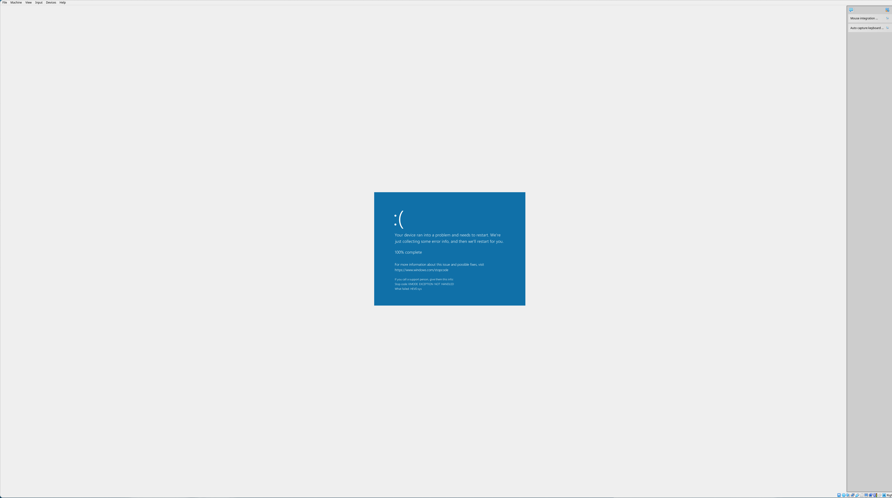

# Extend the Length Faster

If we run our binary with `-help=1`, LibFuzzer will helpfully inform us of all the
different options to pass to the fuzzer to control its behavior.

```powershell
./fuzzer.exe -help=1
```

The first thing we can adjust is the `len_control` option. Let's try setting it to `0`,
which will tell the fuzzer not to wait before extending the input to be very long.

```powershell
./fuzzer.exe -len_control=0
```



Boop! That did it. In many cases, this is all you need to discover trivial buffer
overflows.

